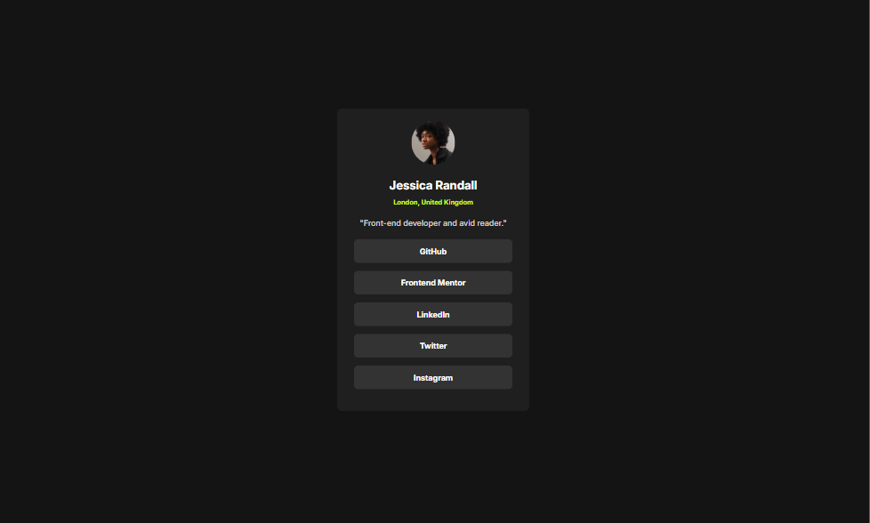
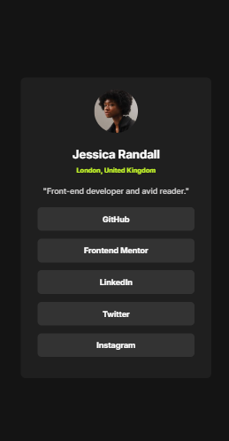

# Frontend Mentor - Social links profile solution

This is a solution to the [Social links profile challenge on Frontend Mentor](https://www.frontendmentor.io/challenges/social-links-profile-UG32l9m6dQ). Frontend Mentor challenges help you improve your coding skills by building realistic projects. 

## Table of contents

- [Overview](#overview)
  - [Screenshot](#screenshot)
  - [Links](#links)
- [Author](#author)

## Overview
Social Links Profile using HTML and CSS

### Screenshot

#### Desktop

#### Mobile

### Links

- Solution URL: (https://github.com/aagah20/frontend-Projects/tree/main/socialLinksProfile)
- Live Site URL: (https://aagah20.github.io/frontend-Projects/socialLinksProfile/)

## Author

- Website - (https://aagah20.github.io/frontend-Projects/socialLinksProfile/)
- Frontend Mentor - [@aagah20](https://www.frontendmentor.io/profile/aagah20)

